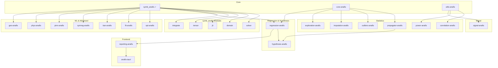

# AnaFis Ecosystem Roadmap

> **AnaFis**: Advanced Numerical Analysis and Fitting Interface System  
> A "No-Compromise" Statistical Engine for Experimental Physics (SOTA 2026)

## Philosophy: "Neural & Rigorous Metrology"

- **Classical-Neural Hybrid**: AnaFis doesn't discard classical statistics (GUM/JCGM) but augments it with modern ML (Variational Inference, PINNs, Neural Estimators) where analytics fail.
- **Uncertainty First**: `UncertaintyTensor` is the source of truth. Methods that don't propagate uncertainty are banned or wrapped in probabilistic layers.
- **Compliance**: JCGM 101/102 as foundation, extended to modern "Uncertainty Quantification" (UQ) frontiers.

---

## Tasks

### Symbolic Engine (`symb_anafis`)
- [x] Pratt parser with implicit multiplication
- [x] Symbolic differentiation engine
- [x] Registry of 50+ functions with derivatives
- [x] Compiled bytecode evaluator with SIMD
- [x] Uncertainty propagation via dual numbers
- [x] Python bindings (PyO3)
- [x] CSE (Common Subexpression Elimination) in compiler
- [x] Compile-time singularity detection (E/E, sin(E)/E → sinc)
- [x] Modular evaluator architecture (7 focused modules)
- [x] Property-based testing (quickcheck)
- [x] Developer documentation (CONTRIBUTING.md, agentic workflows)

### Domain Analysis (`symb_anafis::domain`) - HIGH PRIORITY
- [ ] Detect division by zero patterns at compile time
- [ ] Conditional bytecode with L'Hôpital fallbacks
- [ ] Series expansion for limits (`series(sin(x)/x, x, 0)`)
- [ ] Full domain inference (log domain, sqrt domain, etc.)

### Compiler Optimization Levels (`symb_anafis::config`) - HIGH PRIORITY
- [ ] Flags for Stack VM vs Cranelift JIT
- [x] CSE (Common Subexpression Elimination) pass optimization
- [ ] Integration with JIT and Domain Analysis modules

### JIT Compilation (`symb_anafis::jit`) - HIGH PRIORITY
- [ ] Cranelift backend: basic arithmetic ops
- [ ] Trig/exp/log function calls
- [ ] SIMD vectorization in JIT
- [ ] Benchmarks: target > Stack VM for >1M evaluations

### Extended Functions (`symb_anafis::special`) - MEDIUM PRIORITY
- [ ] Factorial, DoubleFactorial
- [ ] ei(x): Exponencial Integral
- [ ] li(x): Logaritmo Integral
- [ ] shi(x) e chi(x): Seno e Cosseno Integral Hiperbólico
- [ ] si(x) e ci(x): Seno e Cosseno Integral
- [ ] hyp1f1(a, b, x): Hipergeométrica Confluente (Kummer)
- [ ] hyp2f1(a, b, c, x): Hipergeométrica de Gauss
- [ ] meijerg: Função G de Meijer
- [ ] erfi(x): Função de Erro Imaginária
- [ ] fresnel_s(x) e fresnel_c(x): Integrais de Fresnel
- [ ] dawson(x): Integral de Dawson
- [ ] upper_gamma(a, x) e lower_gamma(a, x): Funções Gama Incompletas
- [ ] inc_beta(a, b, x): Função Beta Incompleta
- [ ] multigamma: Gama Multivariada
- [ ] subfactorial(n): (!n) Desarranjos
- [ ] laguerre(n, alpha, x): Polinómios de Laguerre
- [ ] chebyshev_t(n, x) e chebyshev_u(n, x): Polinómios de Chebyshev
- [ ] jacobi(n, alpha, beta, x): Polinómios de Jacobi
- [ ] polylog(n, x): Polilogaritmo (Li_n(x))
- [ ] airy_ai(x) e airy_bi(x): Funções de Airy
- [ ] struve_h(v, x) e struve_l(v, x): Funções de Struve
- [ ] dirichlet_eta(s): Função Eta de Dirichlet

### Symbolic Solver (`symb_anafis::solver`) - MEDIUM PRIORITY
- [ ] Linear system solver (Gaussian elimination on Expr)
- [ ] Polynomial root finding (analytical, degrees ≤4)
- [ ] Variable isolation: `solve(y = f(x), x)`
- [ ] Transcendental pattern matching (sin(x) = 0 → x = nπ)
- [ ] Differential Equations
    - ODEs (Ordinary Differential Equations)
    - PDEs (Partial Differential Equations)
    - DAEs (Differential-Algebraic Equations)
    - DDEs (Delay Differential Equations)
    - IDEs (Integro-Differential Equations)
    - SDEs (Stochastic Differential Equations)
    - FDEs (Fractional Differential Equations)

### Series Expansion (`symb_anafis::series`) - MEDIUM PRIORITY
- [ ] Taylor/Maclaurin series
- [ ] Laurent series
- [ ] Asymptotic expansions
- [ ] Power series arithmetic
- [ ] Series composition

### Limit calculation (`symb_anafis::limits`) - MEDIUM PRIORITY
- [ ] Symbolic limit evaluation
- [ ] L'Hôpital's rule application
- [ ] Indeterminate form detection
- [ ] Limit at infinity handling
- [ ] Multivariable limits

### Operational Calculus (`symb_anafis::calculus`) - LOW PRIORITY
- [ ] Operator Mapping (e.g., diff(f,x,2) → D²)
- [ ] Polynomial Operator Decomposition for expression simplification

### Integral Transforms (`symb_anafis::transforms`) - LOW PRIORITY
- [ ] Laplace/Fourier/Mellin symbolic rules

### Integration (`symb_anafis::integrate`) - LOW PRIORITY
- [ ] Table lookup for common patterns
- [ ] Polynomial integration
- [ ] Heuristic Risch algorithm (partial)
- [ ] Numerical fallback with uncertainty

### Symbolic Unit Calculus (`symb_anafis::units`) - LOW PRIORITY
- [ ] Dimension checking ([L], [T], [M]) for Expr

### Coordinate Transformations (`symb_anafis::coords`) - LOW PRIORITY
- [ ] Jacobian-based mapping for coordinate system changes

### Symmetry Analysis (`symb_anafis::symmetry`) - LOW PRIORITY
- [ ] Lie Symmetry Discovery for invariant reduction

### Tensor/Matrix Support (`symb_anafis::tensor`) - LOW PRIORITY
- [ ] `Expr::Matrix` variant with shape tracking
- [ ] Element-wise operations
- [ ] Matrix multiplication differentiation
- [ ] Einstein notation parsing

### Input/Output (`symb_anafis::io`) - LOW PRIORITY
- [ ] LaTeX parsing: `parse(r"\frac{1}{2}x^2")`
- [ ] Jupyter display integration

### Expression Analysis (`symb_anafis::analysis`) - LOW PRIORITY
- [ ] Poles & zeros detection
- [ ] Asymptotic behavior
- [ ] Function properties (even, odd, periodic)
- [ ] Complexity metrics

---

### Core Infrastructure Crates - for doing numerical work on top of the symbolic engine

#### `core-anafis` - Shared Data Types
- [ ] `UncertaintyTensor<T>`: value + σ + correlation
- [ ] Trait `Measurable`: anything with uncertainty
- [ ] `from_gum_type_a()`, `from_gum_type_b()` constructors
- [ ] `#[derive(Measurable)]` proc macro
- [ ] Arrow/ndarray interop

#### `utils-anafis` - Shared Utilities
- [ ] `kernels.rs`: KD-tree (kiddo) + Gaussian kernels
- [ ] `optimization.rs`: argmin wrapper (LBFGS, constraints)
- [ ] `neural.rs`: burn/candle abstraction layer
- [ ] `persistence.rs`: rusqlite result caching

---

### Statistical Module Crates

#### `power-anafis` - Experimental Design
- [ ] Grid-based power simulation (naive)
- [ ] GP surrogate for β(N) curve
- [ ] Bayesian optimization (Expected Improvement)
- [ ] Multi-objective: power vs cost tradeoff

#### `correlation-anafis` - Information Theory
- [ ] Basic KSG (k=3 neighbors)
- [ ] Error-convolved KSG (physics robustness)
- [ ] Partial MI / conditional independence
- [ ] MINE/InfoNCE neural estimator (high-dim)

#### `exploration-anafis` - Latent Variable Models
- [ ] Homoscedastic PPCA via EM
- [ ] Heteroscedastic: Ψ = diag(σ²) from UncertaintyTensor
- [ ] Confidence intervals on loadings
- [ ] Factor rotation (varimax, promax)

#### `propagator-anafis` - Uncertainty Propagation
- [ ] Dual-number propagation (linear/1st-order, GUM Type B)
- [ ] Non-linearity detection via Hessian threshold
- [ ] MCM fallback with adaptive sampling (JCGM 101)
- [ ] Correlated inputs handling (covariance matrix)

#### `outliers-anafis` - Robust Detection
- [ ] Basic MCD with fixed covariance
- [ ] Uncertainty-weighted Mahalanobis distance
- [ ] Iterative refinement with convergence check
- [ ] Multivariate outlier visualization

#### `imputation-anafis` - Missing Data
- [ ] Basic GPR (RBF + WhiteNoise)
- [ ] Noise scaled by known σ from UncertaintyTensor
- [ ] Batch imputation with covariance propagation
- [ ] Multiple imputation for downstream uncertainty

#### `signal-anafis` - Signal Processing
- [ ] DWT with hard thresholding
- [ ] CWT + ridge detection (peak finding)
- [ ] Adaptive threshold (SureShrink)
- [ ] PINN smoother with physics constraint
- [ ] Baseline correction (asymmetric least squares)

#### `regression-anafis` - Model Fitting
- [ ] Basic ODR with known σ_x, σ_y (current `odr_anafis`)
- [ ] Symbolic Jacobian from symb_anafis
- [ ] Parameter uncertainty via exact Hessian
- [ ] Constrained optimization (physical bounds)
- [ ] SINDy: sparse identification of dynamics
- [ ] Model selection (AIC, BIC, cross-validation)

#### `hypothesis-anafis` - Bayesian Testing
- [ ] Laplace approximation for marginal likelihood
- [ ] Bridge sampling (more accurate)
- [ ] Nuisance parameter marginalization (Type B)
- [ ] Savage-Dickey density ratio

---

### ML & Advanced Crates

#### `opt-anafis` - Optimization
- [ ] Gradient descent (SGD, momentum)
- [ ] Adam, AdaGrad optimizers
- [ ] Newton's method (symbolic Hessian)
- [ ] L-BFGS for large-scale
- [ ] Constrained optimization (barriers, projections)

#### `fit-anafis` - General Fitting
- [ ] Nonlinear Least Squares (Levenberg-Marquardt)
- [ ] Weighted Least Squares
- [ ] Model builders (polynomial, exponential, power law)
- [ ] Residual analysis and diagnostics
- [ ] Confidence/prediction bands

#### `kan-anafis` - Kolmogorov-Arnold Networks
- [ ] Basic KAN layer (B-spline basis)
- [ ] Training loop with symbolic output
- [ ] Spline-to-symbolic conversion
- [ ] Pruning and simplification
- [ ] Physics-informed KAN (conservation laws)

#### `symreg-anafis` - Symbolic Regression
- [ ] Expression tree genome
- [ ] Crossover and mutation operators
- [ ] Fitness with complexity penalty
- [ ] Pareto front (accuracy vs simplicity)
- [ ] Constants optimization (CMA-ES)

#### `pinn-anafis` - Physics-Informed Neural Networks
- [ ] Basic PINN architecture (burn backend)
- [ ] PDE residual loss from symb_anafis expressions
- [ ] Boundary condition handling
- [ ] Inverse problems (parameter estimation)
- [ ] Uncertainty quantification (ensemble/dropout)

#### `phys-anafis` - Physics Utilities
- [ ] ODE integrators (RK4, adaptive step)
- [ ] Sensitivity analysis (forward/adjoint)
- [ ] Lagrangian → Euler-Lagrange derivation
- [ ] Hamiltonian mechanics helpers
- [ ] Noether's theorem (symmetry → conservation)

#### `geo-anafis` - Geometry & Graphics
- [ ] Implicit surface utilities (normals, curvature)
- [ ] Ray-marching with symbolic SDF
- [ ] Parametric curve/surface tools
- [ ] Curve fitting with symbolic gradients
- [ ] CSG operations

---

### Integration & GUI

#### `reporting-anafis` - Output Generation
- [ ] Markdown report generator
- [ ] LaTeX report with GUM tables
- [ ] Plot generation (gnuplot/plotly bindings)
- [ ] Jupyter notebook export

#### `anafis-tauri` - Lab Companion GUI
- [x] GUI framework setup (Tauri)
- [x] Data import (CSV, SQLite, Excel)
- [ ] Module workflow orchestration
- [ ] Interactive plots with error bars
- [ ] Real-time sensor data streaming

---

### Ideas / Backlog (Long Term)
- [ ] GPU Acceleration (OpenCL/CUDA for eval_batch >100M points)
- [ ] Complex Numbers (First-class complex arithmetic)
- [ ] Interval Arithmetic (Rigorous bounds computation)
- [ ] WASM Demo (Interactive "Try it now" web page)

---

### Documentation & Examples
- [ ] "Discovering Physical Laws from Data" - Symbolic Regression demo
- [ ] "Neural ODE Training with SymbAnaFis" - PINN + ODE tutorial
- [ ] "Solving Heat Equation via JIT" - JIT performance demo
- [ ] "Uncertainty Propagation for Lab Reports" - GUM workflow tutorial
- [ ] "ODR Fitting with Error Bars" - Physics lab example

---

## Dependency Graph

---

## Technology Stack

| Component     | Crate              | Notes                  |
| ------------- | ------------------ | ---------------------- |
| Core          | ndarray, arrow     | Numeric foundation     |
| Optimization  | argmin             | LBFGS, constraints     |
| JIT           | cranelift          | Native code generation |
| Kernels       | kiddo              | KD-tree for KSG        |
| Distributions | statrs             | PDFs                   |
| FFT           | rustfft            | Spectral/wavelets      |
| GP            | linfa-gp or custom | Imputation             |
| Neural        | burn / candle      | MINE, PINNs, KANs      |
| Persistence   | rusqlite           | Heavy result caching   |
| GUI           | tauri + egui       | Desktop app            |

---

## Contributing

Priority areas:
1. **Beta Testers**: Users applying to ML/Physics problems to report edge cases
2. **Special Functions**: Numeric implementations for obscure physics functions
3. **Docs**: "How-to" guides for beginners
